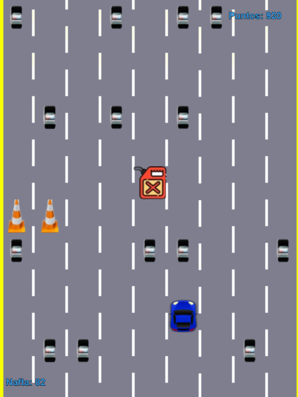

# HighWay Mania!

UTN - Facultad Regional Buenos Aires - Materia Paradigmas de Programación

## Equipo de desarrollo: 

- Barrios Ramiro
- Portnoi Luka
- Quintana Brian
- Rios Tomas
- Santana Matias
 

## Capturas 

## Reglas de Juego / Instrucciones

Nuestro personaje es nada menos que un Porsche 911 Carrera de 1998, y estamos en una frenética carrera para escapar de la policía. 🚓💨 Con gasolina limitada y obstáculos que nos complicarán el escape, ¡cada movimiento cuenta! Si logramos chocar con un bidón de gasolina nuestro tanque subirá 10 unidades, hasta un tope de 100. Pero cuidado, porque los conos en el camino nos harán perder 10 unidades de gasolina. Y si llegamos a chocar con un auto de policía… ¡GAME OVER! 🚫

Cuando el contador de gasolina llegue a 0, nos quedaremos sin combustible y la policía finalmente nos atrapará. El objetivo es alcanzar la mayor cantidad de puntos posible antes de que sea demasiado tarde. ¡Acelera, esquiva, y mantente en el juego todo lo que puedas! 🏎️🔥
## Controles:

- `<-`: Mover a izquierda
- `->`: Mover a derecha
- `Enter`: Iniciar juego
- `r`: Reiniciar juego

# Diagrama 

